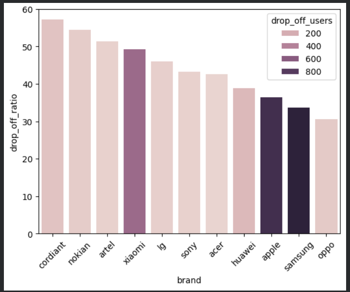

# 🛒 E-Commerce Funnel & Cart Abandonment Analysis

## 📌 Business Problem
In e-commerce, tracking overall conversion rates is not enough. Store managers need to identify specific product categories or **brands** that suffer from high cart abandonment (drop-off rates) to optimize the user journey and protect revenue.

## 🛠️ The Technical Approach
- **SQL:** Extracted and structured data using CTEs (`WITH` clauses) and subqueries to isolate users who added items to their cart but didn't complete a purchase. Applied the `HAVING` clause to filter out low-traffic brands and prevent statistical noise.
- **Python (Pandas & Seaborn):** Processed the resulting dataset and created an advanced visualization utilizing `hue` to combine two metrics simultaneously—drop-off percentage and absolute user volume.

## 📊 Key Visualization & Insights

- **High Ratio vs. High Volume:** While niche brands like 'Cordiant' exhibit a high drop-off percentage (~60%), the absolute volume of lost users is small. Conversely, major brands like **Apple and Samsung** show a moderate percentage (~30-35%), but account for the highest **absolute volume** of drop-offs (nearly 800 users).
- **Product Strategy:** Focusing optimization efforts on high-volume flagship brands yields a significantly higher ROI than targeting niche low-traffic items.
